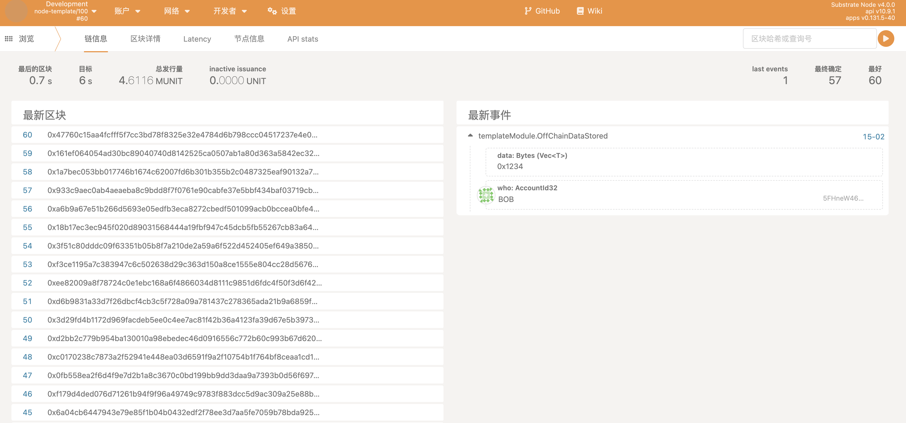
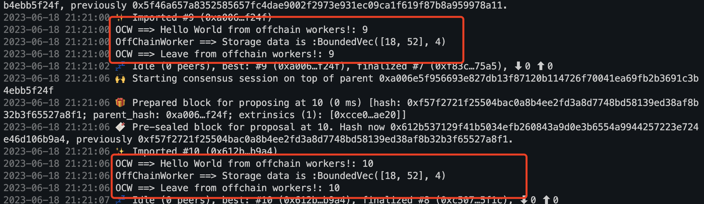
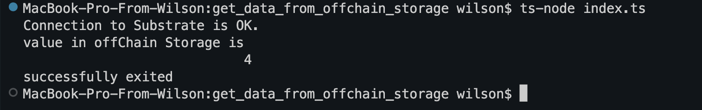
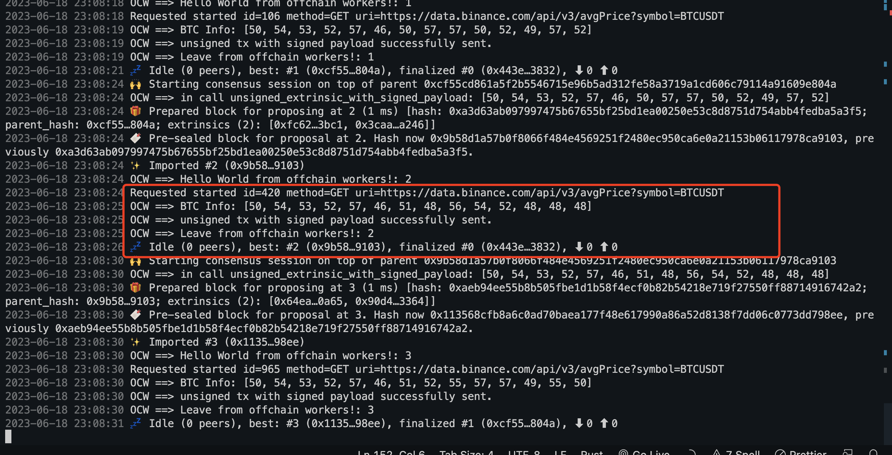

# HW4

- 请回答链上随机数（如前面Kitties示例中）与链下随机数的区别

链上随机数基于区块链算法生成，具有不可篡改性和随机性，可以用于加密、数字签名等业务场景。而链下随机数基于真正的随机事件，比如物理性质的测量或环境噪音等，相对于链上随机数更难以预测和攻击，适用于一些高安全性要求的场景，如密码学、赌博、竞拍等。但链下随机数的生成需要依赖于物理事件，无法简单地通过算法来实现，而且难以在区块链中被验证和确定，容易被篡改。

- 在Offchain Worker中，使用Offchain Indexing特性实现从链上向Offchain Storage中写入数据

- 使用 js sdk 从浏览器frontend获取到前面写入Offchain Storage的数据

- 设计一个场景实例（比如获取一个外部的价格信息），实现从OCW中向链上发起带签名负载的不签名交易，并在Runtime中正确处理

