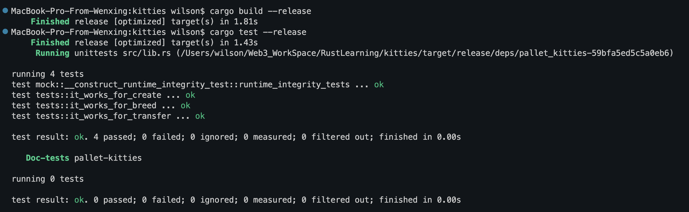
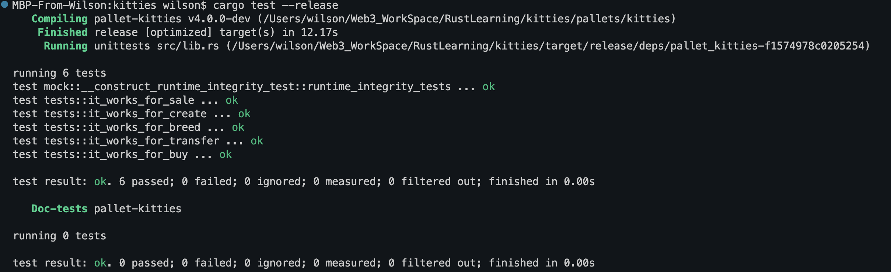
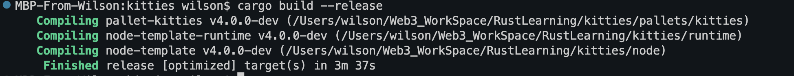
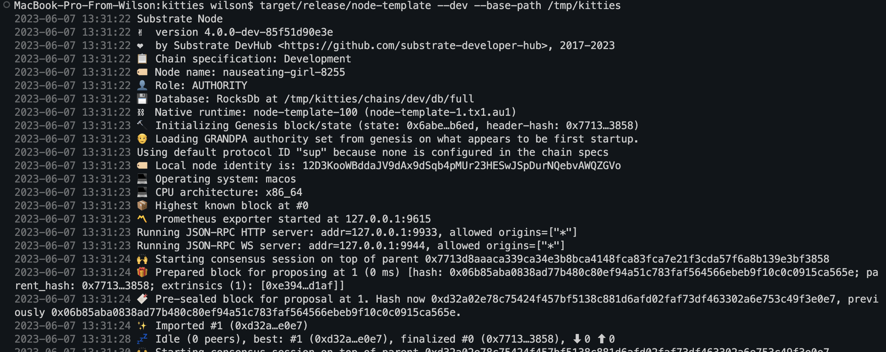
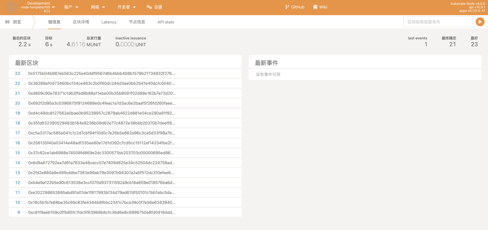
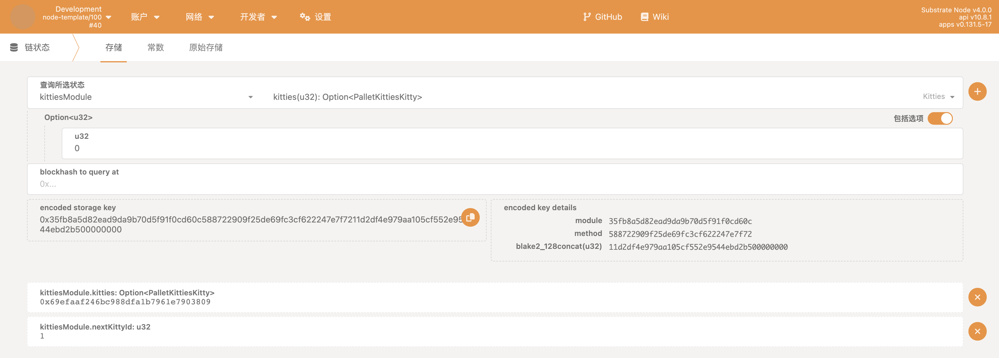
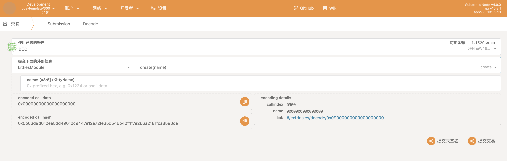
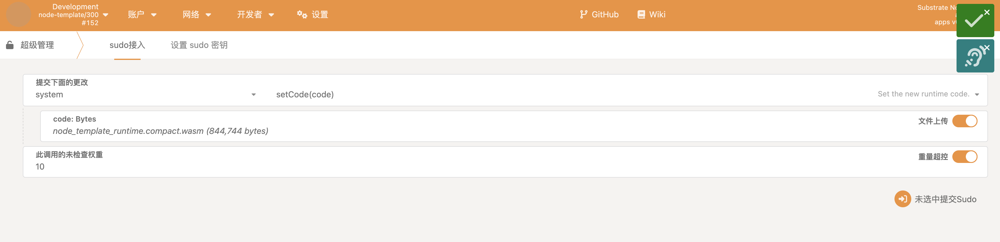
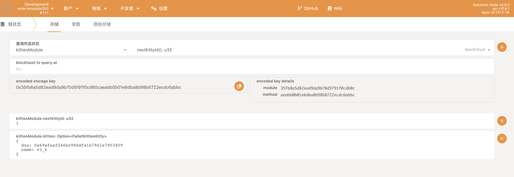

# Kittes Test Result

## Task1

## Task2
### 完成Kitties pallet
1. 增加Currency，sale/buy 方法后Pallet可以编译

2. 增加新的测试用例

3. 修改runtime，node可以编译通过

4. node节点可以启动

### Runtime升级
1. kitties pallet v2

2. 完成migration代码，编译通过

3. v0-v1

4. v1-v2

