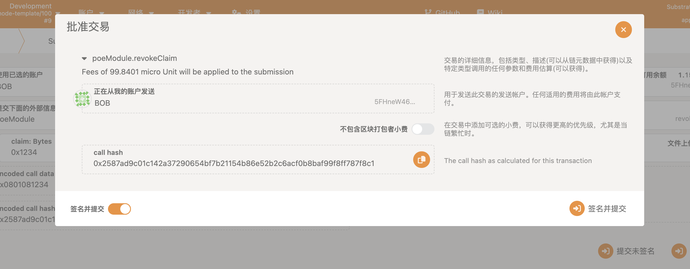
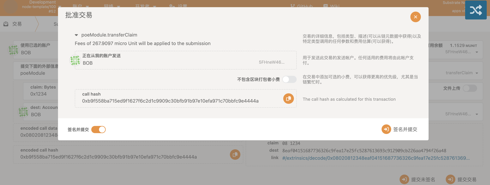

# POE weight deploy

## update weights
* code
https://github.com/cs-wilson/RustLearning/tree/main/poe/pallets/poe/src

### update weight before, the weight almost equal 90

### after update weight, the value is average in 230+

